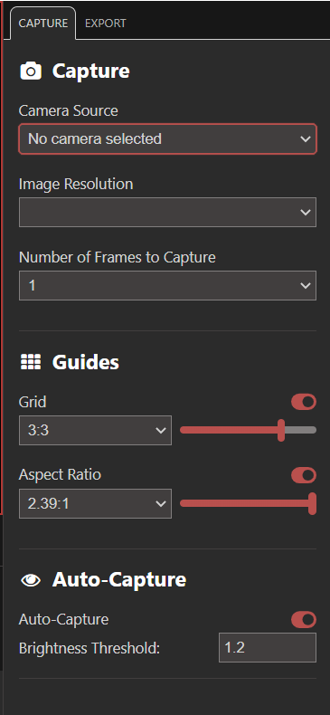

# Main Window

The main window is where you will spend most of your time with Boats Animator.

## Menu bar

The menu bar contains an assortment of options both to do with the current project and the program in general. See [Menu Bar](/features/menu-bar) for further information.

## Preview area

The preview area shows a live feed of the selected camera in **capture mode** and is where frames are played back in **playback mode**. In capture mode a red border is displayed around the preview area.

## Animation toolbar

The animation toolbar contains options for manipulating your animation.

### Left controls

The left controls shown change depending on whether you are in **capture mode** or **playback mode**.

#### Capture mode

**Undo last frame:** this will remove the last frame of your animation and delete it permanently from the hard-drive. A dialog box with "Are you sure you want to delete frame X?" is displayed before deletion occurs.

**Short play:** this will playback the last 5 frames of your animation.

#### Playback mode

**Delete selected frame:** this will remove the currently selected frame of your animation and delete it permanently from the hard-drive. A dialog box with "Are you sure you want to delete frame X?" is displayed before deletion occurs.

### Capture button

Select this button to capture a new frame from the live-feed that is visible in **capture mode**.

### Playback controls

These buttons affect the playback of captured frames in the [preview area](#preview-area).

**First frame:** this displays the first frame captured.

**Previous frame:** this displays one frame before the current frame being displayed.

**Playback/pause frames:** this will begin playback from the first frame captured or resume it from the current frame being displayed if in **playback mode**. If playback has already started this button will pause it.

**Stop playback:** this will stop playback and jump to the last frame captured.

**Next frame:**  this displays one frame after the current frame being displayed.

**Last frame:** this displays the last frame captured.

**Loop playback:** this toggles if playback should continue from the first frame captured when the last frame captured is reached.

## Frame reel

The frame reel area displays thumbnails of all of the frames that have been captured. To display a particular frame in the [preview area](#preview-area) simply select it from the frame reel. The current frame being previewed will have a white outline around it in the frame reel and playback will begin from this frame.

**Live-view button:** on the far right of the frame reel is the live-view button. After previewing captured frames, select this to return to **capture mode**. In capture mode this button has a white outline around it.

## Onion skinning slider

This is used to set the amount of [onion skinning](https://en.wikipedia.org/wiki/Onion_skinning) that is displayed in the preview area in **capture mode**. Move the slider to the right of center to increase the opacity of the last frame captured. At present, moving the slider to the left will have the same effect. To turn off onion skinning move the slider back to the center.

## Frame rate adjuster

This is used to set the number of frames per second to be displayed during playback. Whole numbers between 1 and 60 are accepted.

## Status bar

The status bar contains useful information about the current project. See [Status Bar](/features/status-bar) for further information.

## Sidebar

The sidebar contains options that are not changed very often during animating.

### Capture

#### Camera source

This is used to select the device to capture frames with. The list will automatically update if a device is plugged in or unplugged.

#### Image resolution

This is used to select the resolution to capture frames at. This list will only show resolutions that are supported by the current **camera source**. The last resolution selected will be remembered when you restart Boats Animator.

### Export

#### Change directory

Select this to change the folder Boats Animator exports captured frames to.

#### Export video

Select this to render the captured frames as a video file. You must capture at least one frame for this option to be available. See [Export Video](/features/export-video) for further information.
### Overlays

Overlays are visuals that display over the [preview area](#preview-area). They are for reference only and will not show on capture frames or exported videos.

Use the relevant toggle button to enable an overlay, and then you can adjust it via a drop-menu and opacity slider.

#### Grid overlay

This displays a grid over the preview area in **capture mode**. The grid is commonly used to help follow the [rule of thirds](https://en.wikipedia.org/wiki/Rule_of_thirds).

#### Aspect ratio mask

This displays a mask over the preview area with the selected aspect ratio.

### Auto-Capture

This feature is used to synchronize taking images with a DSLR whose video output is connected via a capture card. The connected DSLR must have "Image Review" or equivalent setting enabled. If Auto-Capture is enabled, it will wait for a black frame (indicating the DSLR is taking a photo), and then capture the next visible frame, which corresponds to the actual photo taken by the DSLR. The quality of this image is often significantly better than the live preview, and corresponds exactly to the full-quality image saved on the DSLR's memory card.

#### Brightness Threshold

This value determines the brightness threshold (0 - 255) between a black frame (DSLR is taking a photo) and visible frame. Note that sufficiently dark scenes are indistinguishable from the black frames a DSLR outputs while taking a photo, so pictures may be erroneously captured as the brightness level floats around the threshold value.
